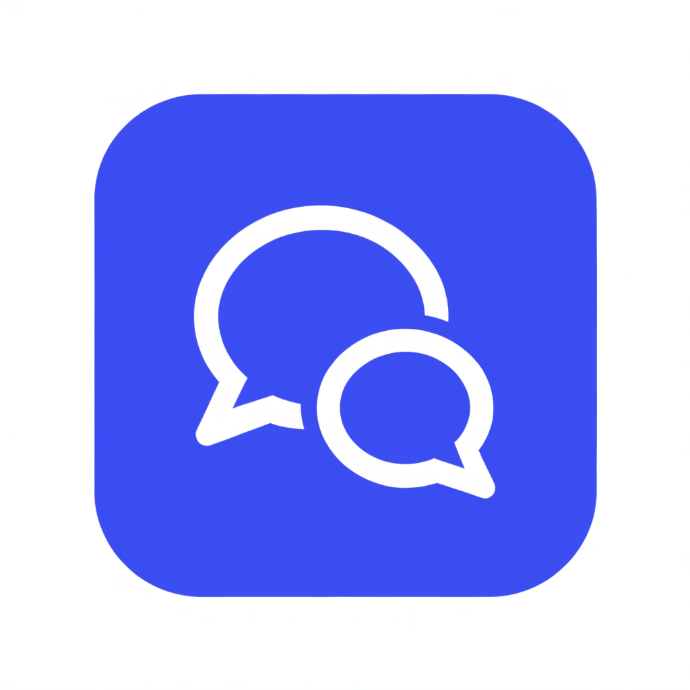
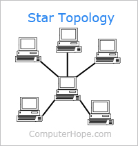
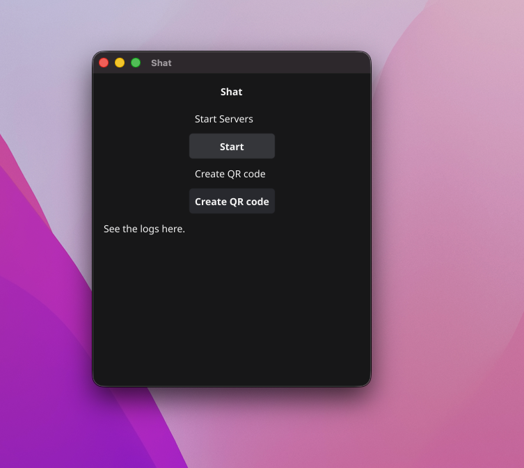
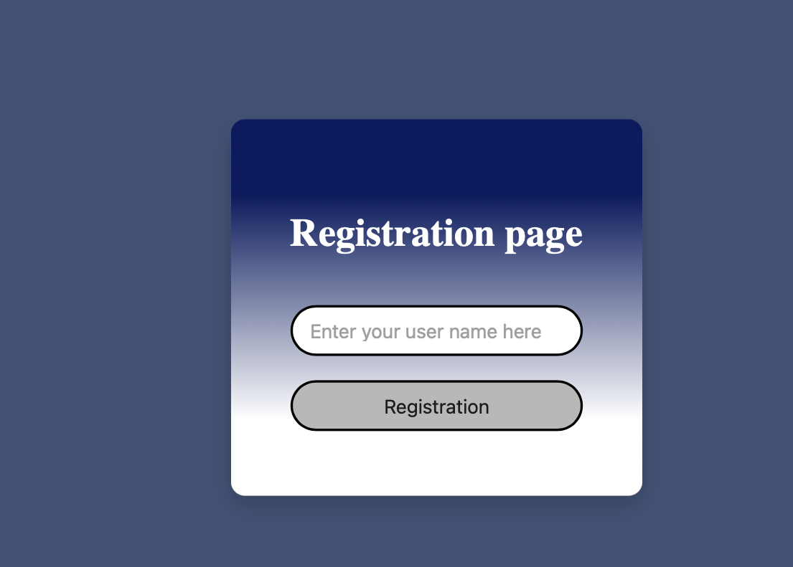
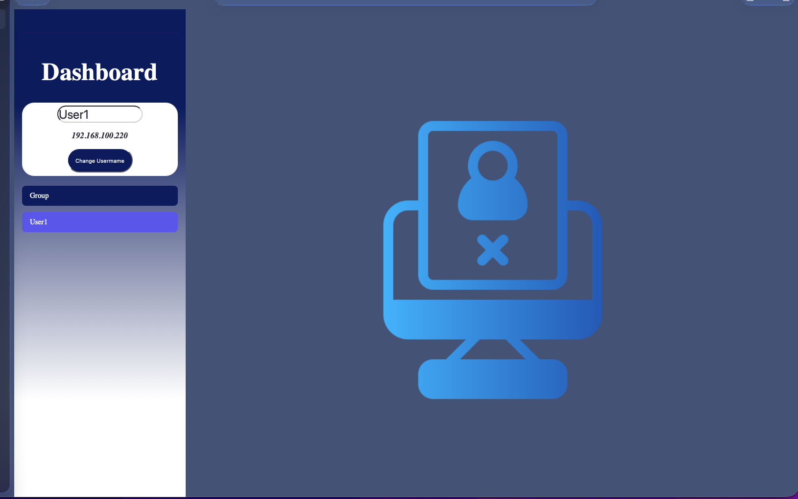
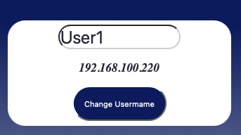
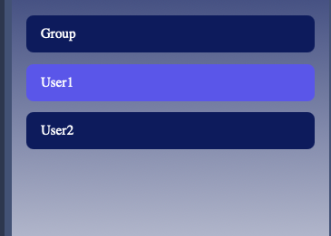
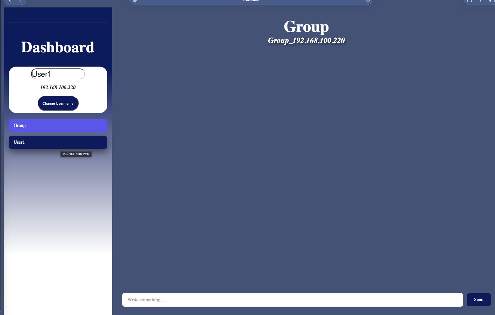

# Shat

<p align="center">
    
</p>

# ❓ What is this

This is a simple light-weight single-use [LAN](https://en.wikipedia.org/wiki/Local_area_network) based chat application.

Click here 👉 [to navigate to user features](#forusers) <br>
Click here 👉 [to navigate to developer features](#fordevelopers)

# 💻 About this project

This application focuses on fixing call lag caused by slow internet connections. Take school classes as an example: during coding lessons, teachers often share their screens via [Microsoft Teams](https://www.microsoft.com/en-us/microsoft-teams/log-in), but due to poor connection speeds, the stream lags or freezes completely.

> ❗️ The last feature is still missing because I've been focusing on text transfer rather than video calling, but I plan to implement the video call function as well. 

## <a name="forusers"></a>⚡️ Core Features

This is a chat application that contains all the necessary features to work properly, including:
* ༕ **Registration** - Easy registration, only your name is needed.
* ✉️ **Private Messaging** - Real-time messaging with your friends.
* 📭 **Group Messaging** - Real-time messaging with all your mates.

## 📦 How to access

The application itself is only available in a desktop version. <br>
Navigate to the Releases menu on the left and choose the appropriate package.

## 🤔 How to use

### 🛜 Hoster 

This application provides a star-topology client-server connection. <br>
This means that one of the nodes acts as the server.

<p align="center">
    
</p>

<hr>

After opening the app this screen will greet you.

<p align="center">
    
</p>

There is 2 option what you see here.

1. **Start Button** – Starts the server.
   * Once the server starts, this button will show *Stop*.
   * Clicking the *Stop* button will shut down the server.

2. **Generate QR Code** - This button will generate a readable QR code in a niew window.

3. **Log Message Container** - Logs, notifications, and errors will be shown here.
    * The website link will also be shown here.

<hr>

### 🧑‍💻 User

After navigation to the hosted page by: <br>
- **Scanning the QR code**  <br>
Or
- **Navigating to the [`http://shat.local:3000`](http://shat.local:3000) in a browser:** 

This page will appear in front of you.

<p align="center">
    
</p>

In the input field, just enter an ID or something that is specific to you. 

<hr>

By pressing Enter, you will be navigated to this page.

<p align="center">
    
</p>

Here you find a possibility to cahnge your name. <br>

<p align="center">
    
</p>

You will see here the *group* chat and a list of the other users.

<p align="center">
    
</p>

Select the targeted user you want to chat with.  <br>
Or choose the *group* chat if you want to chat with every one. <br>
> There is a possibility to talk with yourself.

<hr>

Once you select a user, this will appear in front of you.

<p align="center">
    
</p>

This layout is very similar to the other one, so you won't get lost.

<hr>

### 🤏 Small feauteres

* If you disconnect by closing the browser or just the tab, your progress won't be lost. However, your name will disappear from the user list, and your friends won't be able to send you messages while you are away.

* If you return, your data will remain intact.

* You cannot re-register unless the host stops the server, which will reset all processes.

## <a name="fordevelopers"></a> 🛠️ Developer Guidance

**Just a heads up:** *like 99% of developers out there, I used AI and premade code during development.*

## 📚 Tech Stack 

* **[Fyne](https://fyne.io/)** (The main application and its UI.)
    * **[Go](https://go.dev/)** (The application and the backend programming language.)
* **[SvelteKit](https://svelte.dev/docs/kit/introduction)** (Framework of the web page.)
   * **[TypeScript](https://www.typescriptlang.org/)** (Main programming language of the web page.)

*In the beginning, I wanted to build something lightweight that didn't consume a lot of resources, with easy-to-understand code, which is why I chose Go and Svelte over Rust and React.*

## 🌳 File tree
```
├── Shat.app
│   └── Contents
│       ├── MacOS
│       │   └── Shat
│       ├── Resources
│       │   └── icon.icns
│       └── Info.plist
├── chat
│   ├── client
│   │   └── client.go
│   ├── helper
│   │   ├── generateroomid.go
│   │   └── validateclient.go
│   └── logic
│       ├── bradcastuserlist.go
│       ├── bradcastuserlist_test.go
│       ├── chat_test.go
│       ├── chatsessionmanagger.go
│       ├── groupchat.go
│       ├── handshake.go
│       ├── privatechat.go
│       └── wstest_test.go
├── components
│   ├── docs
│   │   ├── appIcon.png
│   │   ├── changeuser.png
│   │   ├── chat.png
│   │   ├── dashboard.png
│   │   ├── greedingscreen.png
│   │   ├── regpage.png
│   │   ├── star.png
│   │   └── userlist.png
│   ├── createQRCode.go
│   ├── logScrollConainer.go
│   ├── startButton.go
│   └── title.go
├── history
│   └── chathistory.go
├── logs
│   └── log.go
├── page
│   ├── .svelte-kit
│   │   ├── generated
│   │   │   ├── client
│   │   │   │   ├── nodes
│   │   │   │   │   ├── 0.js
│   │   │   │   │   ├── 1.js
│   │   │   │   │   ├── 2.js
│   │   │   │   │   ├── 3.js
│   │   │   │   │   └── 4.js
│   │   │   │   ├── app.js
│   │   │   │   └── matchers.js
│   │   │   ├── client-optimized
│   │   │   │   ├── nodes
│   │   │   │   │   ├── 0.js
│   │   │   │   │   ├── 1.js
│   │   │   │   │   ├── 2.js
│   │   │   │   │   ├── 3.js
│   │   │   │   │   └── 4.js
│   │   │   │   ├── app.js
│   │   │   │   └── matchers.js
│   │   │   ├── server
│   │   │   │   └── internal.js
│   │   │   ├── shared
│   │   │   │   └── error-template.js
│   │   │   ├── root.js
│   │   │   └── root.svelte
│   │   ├── output
│   │   │   ├── client
│   │   │   │   ├── .vite
│   │   │   │   │   └── manifest.json
│   │   │   │   ├── _app
│   │   │   │   │   ├── immutable
│   │   │   │   │   │   ├── assets
│   │   │   │   │   │   │   ├── 3.DYjz4xrY.css
│   │   │   │   │   │   │   ├── _page.CVyOT5ku.css
│   │   │   │   │   │   │   ├── activityindicator.D_KqRG2p.css
│   │   │   │   │   │   │   ├── app.vvP9JiAJ.css
│   │   │   │   │   │   │   ├── favicon.CpsdKg1U.svg
│   │   │   │   │   │   │   └── user-not-found.xxHnkdOs.png
│   │   │   │   │   │   ├── chunks
│   │   │   │   │   │   │   ├── BFVidDbq.js
│   │   │   │   │   │   │   ├── Bjy-W4x2.js
│   │   │   │   │   │   │   ├── C2-x1RC8.js
│   │   │   │   │   │   │   ├── i9yqHFOd.js
│   │   │   │   │   │   │   ├── td7rEt7v.js
│   │   │   │   │   │   │   └── xihTtKlq.js
│   │   │   │   │   │   ├── entry
│   │   │   │   │   │   │   ├── app.DypKf9yx.js
│   │   │   │   │   │   │   └── start.r0mt0D6Q.js
│   │   │   │   │   │   └── nodes
│   │   │   │   │   │       ├── 0.VrdAjs1c.js
│   │   │   │   │   │       ├── 1.D2XYKPcH.js
│   │   │   │   │   │       ├── 2.CWwXNVXd.js
│   │   │   │   │   │       ├── 3.DcJKH2_Z.js
│   │   │   │   │   │       └── 4.D8KpMEiy.js
│   │   │   │   │   └── version.json
│   │   │   │   └── robots.txt
│   │   │   ├── prerendered
│   │   │   │   └── pages
│   │   │   │       ├── pages
│   │   │   │       │   ├── Dashboard
│   │   │   │       │   │   └── index.html
│   │   │   │       │   └── Login
│   │   │   │       │       └── index.html
│   │   │   │       └── index.html
│   │   │   └── server
│   │   │       ├── .vite
│   │   │       │   └── manifest.json
│   │   │       ├── _app
│   │   │       │   └── immutable
│   │   │       │       └── assets
│   │   │       │           ├── _page.CVyOT5ku.css
│   │   │       │           ├── _page.n2HVJryx.css
│   │   │       │           ├── activityindicator.D_KqRG2p.css
│   │   │       │           ├── app.vvP9JiAJ.css
│   │   │       │           ├── favicon.CpsdKg1U.svg
│   │   │       │           └── user-not-found.xxHnkdOs.png
│   │   │       ├── chunks
│   │   │       │   ├── _page.js
│   │   │       │   ├── activityindicator.js
│   │   │       │   ├── client.js
│   │   │       │   ├── env.js
│   │   │       │   ├── exports.js
│   │   │       │   ├── index-server.js
│   │   │       │   ├── internal.js
│   │   │       │   ├── internal2.js
│   │   │       │   ├── server.js
│   │   │       │   ├── shared.js
│   │   │       │   └── utils.js
│   │   │       ├── entries
│   │   │       │   ├── fallbacks
│   │   │       │   │   └── error.svelte.js
│   │   │       │   └── pages
│   │   │       │       ├── pages
│   │   │       │       │   ├── Dashboard
│   │   │       │       │   │   └── _page.svelte.js
│   │   │       │       │   └── Login
│   │   │       │       │       └── _page.svelte.js
│   │   │       │       ├── _layout.svelte.js
│   │   │       │       ├── _layout.ts.js
│   │   │       │       └── _page.svelte.js
│   │   │       ├── nodes
│   │   │       │   ├── 0.js
│   │   │       │   ├── 1.js
│   │   │       │   ├── 2.js
│   │   │       │   ├── 3.js
│   │   │       │   └── 4.js
│   │   │       ├── stylesheets
│   │   │       ├── env.js
│   │   │       ├── index.js
│   │   │       ├── internal.js
│   │   │       ├── manifest-full.js
│   │   │       ├── manifest.js
│   │   │       └── remote-entry.js
│   │   ├── types
│   │   │   ├── src
│   │   │   │   └── routes
│   │   │   │       ├── pages
│   │   │   │       │   ├── Dashboard
│   │   │   │       │   │   └── $types.d.ts
│   │   │   │       │   └── Login
│   │   │   │       │       └── $types.d.ts
│   │   │   │       └── $types.d.ts
│   │   │   └── route_meta_data.json
│   │   ├── ambient.d.ts
│   │   ├── env.d.ts
│   │   ├── non-ambient.d.ts
│   │   └── tsconfig.json
│   ├── cypress
│   │   ├── e2e
│   │   │   ├── dashboard.cy.ts
│   │   │   └── login.cy.ts
│   │   ├── fixtures
│   │   │   └── example.json
│   │   ├── screenshots
│   │   └── support
│   │       ├── commands.ts
│   │       └── e2e.ts
│   ├── src
│   │   ├── lib
│   │   │   ├── assets
│   │   │   │   ├── favicon.svg
│   │   │   │   └── user-not-found.png
│   │   │   ├── components
│   │   │   │   ├── logic
│   │   │   │   │   ├── manageWebSocketConn.svelte.ts
│   │   │   │   │   ├── port.svelte.ts
│   │   │   │   │   ├── redirectuser.svelte.ts
│   │   │   │   │   └── userName.svelte.ts
│   │   │   │   └── ui
│   │   │   │       ├── activityindicator.svelte
│   │   │   │       ├── changeName.svelte
│   │   │   │       ├── chatUI.svelte
│   │   │   │       └── registration.svelte
│   │   │   ├── index.ts
│   │   │   └── utils.ts
│   │   ├── routes
│   │   │   ├── pages
│   │   │   │   ├── Dashboard
│   │   │   │   │   ├── +page.svelte
│   │   │   │   │   └── dashboard.test.ts
│   │   │   │   └── Login
│   │   │   │       ├── +page.svelte
│   │   │   │       └── login.test.ts
│   │   │   ├── +layout.svelte
│   │   │   ├── +layout.ts
│   │   │   └── +page.svelte
│   │   ├── app.css
│   │   ├── app.d.ts
│   │   ├── app.html
│   │   └── vitest-setup.ts
│   ├── static
│   │   └── robots.txt
│   ├── .gitignore
│   ├── .npmrc
│   ├── README.md
│   ├── bun.lock
│   ├── components.json
│   ├── cypress.config.ts
│   ├── package.json
│   ├── tsconfig.json
│   └── vite.config.ts
├── qrcode
│   └── createQRCode.go
├── readme
├── runmanager
│   ├── components
│   │   ├── closinghttp.go
│   │   └── closingmdns.go
│   └── managger.go
├── server
│   ├── helper
│   │   ├── ipaddressforhttp.go
│   │   ├── ipadressfordns.go
│   │   └── isportinuse.go
│   ├── logic
│   │   ├── apiendpoint_test.go
│   │   ├── redirectuser.go
│   │   ├── restorechatdata.go
│   │   ├── servepage.go
│   │   ├── submitnewusername.go
│   │   ├── submitusername.go
│   │   └── wshandshake.go
│   ├── apiendpoint.go
│   ├── mdnsserver.go
│   └── port.go
├── assets.go
├── buildpage.sh
├── go.mod
├── go.sum
├── main.go
└── readme.md
```

## 👨‍💻 Actual Development


To start development just clone this repository. 
```bash
git clone 
```
Or download the ZIP.

<hr>

Start dev server with this command.
```bash
go run .
```

Build the project.
```bash
fyne package -icon components/appIcon.png
```


> May be needed to download all necessary dependencies.
```bash
go mod download
```

# 🪪 License